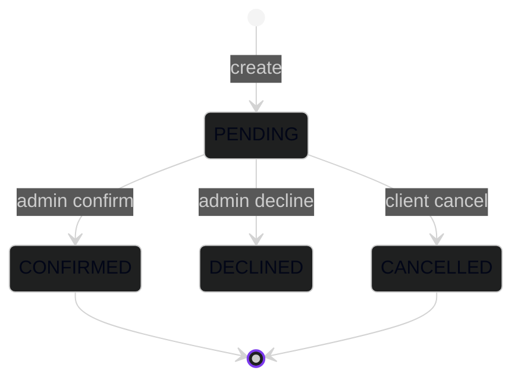

<div align="center">

<!-- animated header -->


<!-- typing tagline -->
<a href="https://git.io/typing-svg">
  
</a>

<br/>

### ⟡ Live telemetry ⟡

[](https://github.com/AbdulWajid768/django_boilerplate/stargazers)
[](https://github.com/AbdulWajid768/django_boilerplate/network/members)
[](https://github.com/AbdulWajid768/django_boilerplate/watchers)
[](https://github.com/AbdulWajid768/django_boilerplate/issues)

[](https://github.com/AbdulWajid768/django_boilerplate/commits/main)
[](https://github.com/AbdulWajid768/django_boilerplate/graphs/commit-activity)
[](https://github.com/AbdulWajid768/django_boilerplate)
[](https://github.com/AbdulWajid768/django_boilerplate)

[](https://www.python.org/)
[](https://www.djangoproject.com/)
[](https://www.django-rest-framework.org/)

<br/>


<br/><br/>

[⚡ Quick start](#-quick-start) · [🛰 Architecture](#-architecture) · [📡 API](#-api-surface) · [🚀 Deploy](#-deploy)


</div>

---

## ◈ Transmission

> **Mission:** Deploy a **production-shaped** Django REST backend without rewiring fundamentals every sprint.

`django_boilerplate` is a **flat-app DRF chassis**—email users, Google `id_token` verification, service catalogs, slot scheduling, appointment state machines, and CMS singletons. **SQLite + console email** boot locally; flip env vars for Postgres, SMTP, and hardened prod.

```text
     ┌─────────────┐     JWT / OAuth      ┌──────────────┐
     │  Client SPA │ ◄──────────────────► │  /api/v1/*   │
     └─────────────┘                      │  Django+DRF  │
                                          └──────┬───────┘
                                                 │
                    ┌────────────────────────────┼────────────────────────────┐
                    ▼                            ▼                            ▼
              accounts/                    appointments/                 site_content/
              services/                      slots/                      signals → mail
```

---

## ◈ Stack matrix

| Layer | Module | Role |
| --- | --- | --- |
| Core | Django 5.1 + DRF | HTTP + serialization |
| Identity | Simple JWT + `google-auth` | Bearer sessions |
| Persistence | SQLite ↔ PostgreSQL | Dev/prod parity |
| Assets | Pillow + WhiteNoise | Media + static |
| Edge | CORS headers | SPA coupling |

---

## ◈ Architecture

```text
core/           settings · WSGI/ASGI · /api/v1 router
common/         mixins · singletons · email · validators
accounts/       User + Client · Google auth endpoints
services/       Service catalog
slots/          AvailableSlot + recurring-slot admin
appointments/   Booking lifecycle · signals · templates
site_content/   PaymentInstruction · SiteSettings · Contact
```

Each app owns `api/v1/`—scale by **adding apps**, not inflating a god-module.

---

## ◈ Quick start

```bash
git clone https://github.com/AbdulWajid768/django_boilerplate.git
cd django_boilerplate

python3 -m venv .venv && source .venv/bin/activate
pip install -r requirements.txt

cp .env.sample .env

python manage.py migrate
python manage.py loaddata services/fixtures/initial_services.json \
                        site_content/fixtures/initial_site.json
python manage.py createsuperuser
python manage.py runserver
```

| Endpoint | URL |
| --- | --- |
| Admin | `http://127.0.0.1:8000/admin/` |
| API | `http://127.0.0.1:8000/api/v1/` |

---

## ◈ API surface

| Method | Path | Auth | Purpose |
| --- | --- | --- | --- |
| GET | `/services/` | — | Service catalog |
| GET | `/slots/?date=&type=` | — | Bookable slots |
| GET | `/slots/available-dates/` | — | Dates with availability |
| GET | `/payment-instructions/` | — | Payment singleton |
| GET | `/site-settings/` | — | Site copy & stats |
| POST | `/appointments/` | — | Create booking |
| POST | `/contact/` | — | Contact form |
| POST | `/auth/google/` | — | Google → JWT |
| POST | `/auth/refresh/` | — | Refresh token |
| GET/PATCH | `/clients/me/` | Bearer | Profile |
| GET | `/appointments/mine/` | Bearer | Own bookings |
| POST | `/appointments/mine/<ref>/cancel/` | Bearer | Cancel pending |

---

## ◈ Booking lifecycle



`select_for_update()` on slot rows prevents double-booking under load.

---

## ◈ Deploy

1. `ENVIRONMENT=prod`, `DEBUG=false`, strong secrets, real DB + SMTP + `GOOGLE_CLIENT_ID`.
2. `python manage.py collectstatic --noinput`
3. **Gunicorn** → `core.wsgi:application` behind your proxy.
4. Persistent `media/` volume (or object storage later).

---

<div align="center">

### ⟡ Pulse over time ⟡

<a href="https://star-history.com/#AbdulWajid768/django_boilerplate&Date">
  <picture>
    <source media="(prefers-color-scheme: dark)" srcset="https://api.star-history.com/svg?repos=AbdulWajid768/django_boilerplate&type=Date&theme=dark"/>
    
  </picture>
</a>

<br/>

<a href="https://github.com/AbdulWajid768">
  
</a>

<sub>Auto-refreshed daily via GitHub Actions (replaces paused Vercel activity-graph API).</sub>

<br/>

**[Abdul Wajid](https://github.com/AbdulWajid768)** · Software Engineer · Lahore, PK

[](https://github.com/AbdulWajid768)
[](https://www.linkedin.com/in/abdul-wajid-amin/)

<br/>


<sub>Forge the backend · Ship the next timeline.</sub>

</div>
