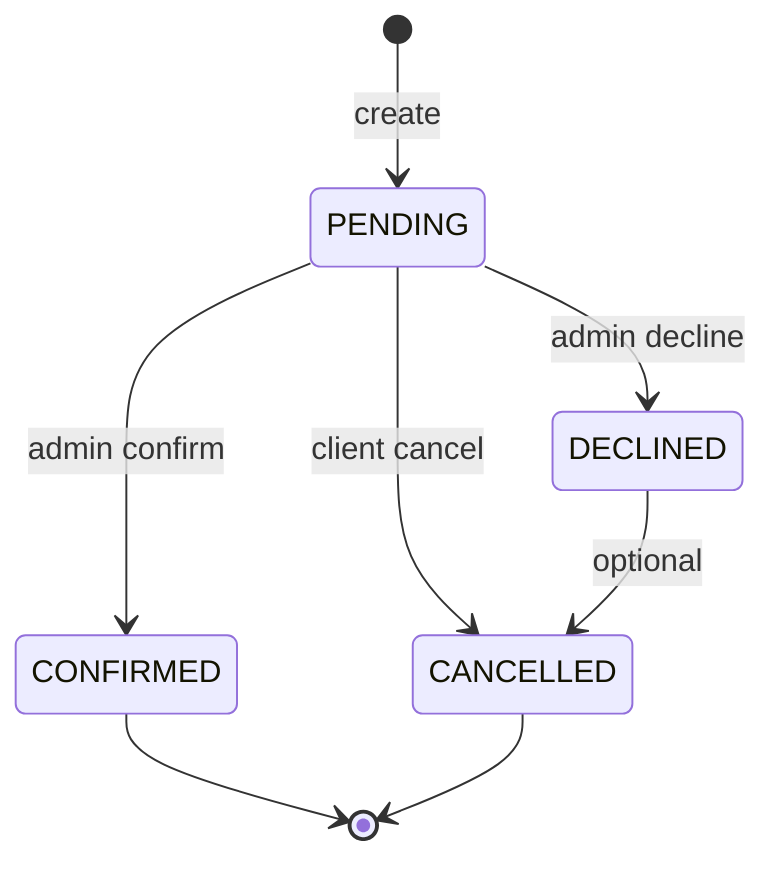

<div align="center">

```
╔══════════════════════════════════════════════════════════════════╗
║  ░▒▓  DJANGO BOILERPLATE  ▓▒░                                   ║
║  Production-grade API spine · DRF · JWT · OAuth-ready             ║
╚══════════════════════════════════════════════════════════════════╝
```

[](https://www.python.org/)
[](https://www.djangoproject.com/)
[](https://www.django-rest-framework.org/)
[](LICENSE)

**Launch a multi-app REST backend in minutes—not months.**

[Quick start](#-quick-start) · [Architecture](#-architecture) · [API surface](#-api-surface) · [Deploy](#-deploy)

</div>

---

## ◈ Signal

`django_boilerplate` is a **flat-app Django + DRF starter** wired for real products: email-based users, Google OAuth token verification, service catalogs, slot scheduling, appointment lifecycle, and CMS-style site singletons. SQLite boots locally with zero infra; Postgres and SMTP drop in via env.

Built for teams who want **opinionated structure** without framework magic.

---

## ◈ Stack

| Layer | Tech |
| --- | --- |
| Runtime | Django 5.1, DRF, Simple JWT |
| Auth | Google `id_token` verification (`google-auth`) |
| Data | PostgreSQL (prod) · SQLite (local fallback) |
| Media | Pillow · WhiteNoise static |
| Cross-origin | `django-cors-headers` |

---

## ◈ Architecture

```text
core/           settings · WSGI/ASGI · /api/v1 router
common/         mixins · singletons · email · validators
accounts/       User + Client profile · Google auth endpoints
services/       Service catalog
slots/          AvailableSlot + recurring-slot admin tooling
appointments/   Booking lifecycle · signals · email templates
site_content/   PaymentInstruction · SiteSettings · ContactMessage
```

Each app owns `api/v1/` (`urls`, `views`, `serializers`)—extend by adding apps, not by bloating a monolith.

---

## ◈ Quick start

```bash
git clone https://github.com/AbdulWajid768/django_boilerplate.git
cd django_boilerplate

python3 -m venv .venv && source .venv/bin/activate
pip install -r requirements.txt

cp .env.sample .env   # SQLite + console email work out of the box

python manage.py migrate
python manage.py loaddata services/fixtures/initial_services.json \
                        site_content/fixtures/initial_site.json
python manage.py createsuperuser
python manage.py runserver
```

Admin: `http://127.0.0.1:8000/admin/` · API root: `http://127.0.0.1:8000/api/v1/`

---

## ◈ API surface

| Method | Path | Auth | Purpose |
| --- | --- | --- | --- |
| GET | `/services/` | — | Active service catalog |
| GET | `/slots/?date=&type=` | — | Bookable slots |
| GET | `/slots/available-dates/` | — | Dates with availability |
| GET | `/payment-instructions/` | — | Singleton payment payload |
| GET | `/site-settings/` | — | Site copy & stats |
| POST | `/appointments/` | — | Create booking |
| POST | `/contact/` | — | Contact form |
| POST | `/auth/google/` | — | Google login → JWT pair |
| POST | `/auth/refresh/` | — | Refresh access token |
| GET/PATCH | `/clients/me/` | Bearer | Client profile |
| GET | `/appointments/mine/` | Bearer | Own bookings |
| POST | `/appointments/mine/<ref>/cancel/` | Bearer | Cancel pending booking |

---

## ◈ Booking lifecycle



Slot rows use `select_for_update()` on create to prevent double-booking under concurrency.

---

## ◈ Deploy

1. Set `ENVIRONMENT=prod`, `DEBUG=false`, strong `SECRET_KEY`, real `DB_*`, SMTP, and `GOOGLE_CLIENT_ID`.
2. `python manage.py collectstatic --noinput`
3. Serve with **gunicorn** `core.wsgi:application` behind your reverse proxy.
4. Persist `media/` (or swap to object storage later).

Prod security headers (HSTS, secure cookies) activate when `ENVIRONMENT=prod` and `DEBUG=false`.

---

## ◈ Maintainer

**[Abdul Wajid](https://github.com/AbdulWajid768)** · Software Engineer · Lahore, PK

[](https://github.com/AbdulWajid768)
[](https://www.linkedin.com/in/abdul-wajid-amin/)

---

<div align="center">

<sub>Forge the backend. Ship the future.</sub>

</div>
